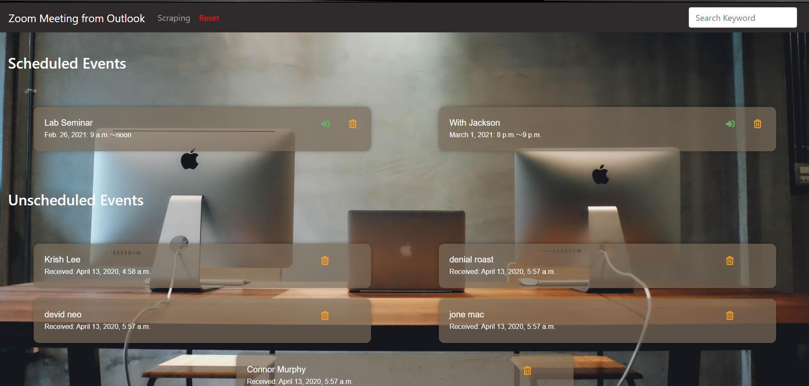
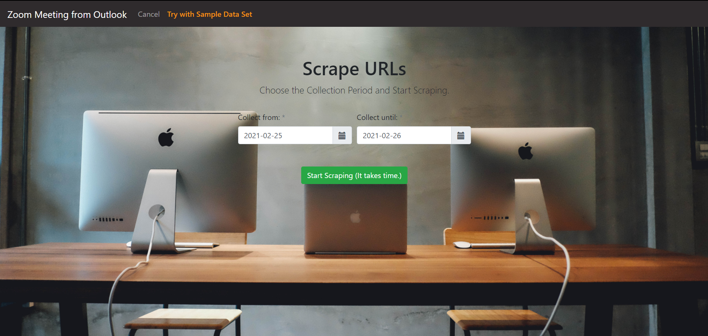
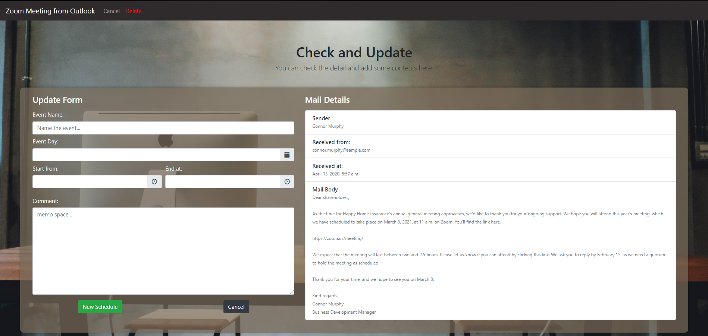

# About this app
This is a web application that extracts and lists Zoom invitation emails in Outlook. Users can delete or add event names, meeting schedules, and comments to each email invitation. The updated mails are displayed by schedule and can be clicked to join the meeting. The email list can also be sorted by filling out letters in top-right search form.




This is the screen for determining the collection period. Users can start scraping by clicking the green button.
The top 'Try with Sample Data Set' is a data set to quickly experience the app. By clicking it, a pre-prepared data set will be entered into the database.




This is the screen for checking and updating the details of mails which users chose in Index Page. Users can add an event name, a meeting schedule and comments and update it.



# How to start this app
```bash
pip install -r requirements.txt
python manage.py makemigrations
python manage.py migrate
python manage.py runserver
```

# How to develop this app
This application is developed by django framework using 1 app (named scraping_tool, also reffered to another repository) and basic skills. So, if you're just getting started django, this app may help you understand the overview of django.

# Technologies and Skills Used
- scraping 
    - We use pywin32, a Python extension for Microsoft Windows, which provides access to much of the Win32 API, the ability to create and use COM objects, and the Pythonwin environment. (https://pypi.org/project/pywin32/)
    - Binary search is performed when searching for e-mails in the aggregation section, because it takes time to retrieve the received time of each e-mail.
- ajax
    - We use it to delete HTML elements by clicking an icon without screen transition.
- django-bootstrap-datepicker-plus (https://pypi.org/project/django-bootstrap-datepicker-plus/)
    - This is a very comvenient widget which has Date-Picker, Time-Picker, DateTime-Picker, Month-Picker and Year-Picker, and we can easily select options by date-range-pickers.
- django-widget-tweaks (https://pypi.org/project/django-widget-tweaks/)
    - This enables us to add parameters, such as class, id, name, etc., in css-like way.


